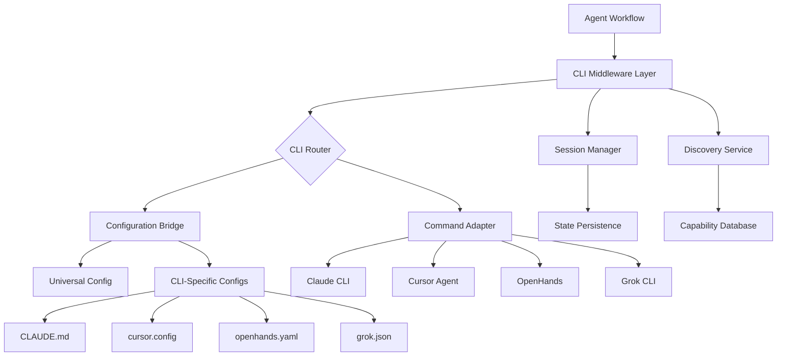

# CLI-Agnostic Platform Architecture

## Overview

This architecture enables the CTO platform to support multiple AI CLI tools (Claude, Cursor, OpenHands, Grok, Gemini, Qwen, Codex) through a standardization middleware layer that translates between our universal configuration format and each CLI's specific requirements.

## Architecture Principles

1. **Discovery First**: Thoroughly understand each CLI before attempting integration
2. **Translation Over Transformation**: Preserve information through configuration translation
3. **Graceful Degradation**: Fall back to known-working CLIs when issues arise
4. **Observable Behavior**: Comprehensive logging and metrics for CLI operations
5. **Vendor Independence**: No lock-in to specific AI providers

## System Architecture

### High-Level Design



## Component Design

### 1. Discovery Service

The foundation for understanding each CLI tool's behavior and requirements.

```rust
// controller/src/cli/discovery.rs
pub struct DiscoveryService {
    test_harness: TestHarness,
    capability_store: CapabilityStore,
}

pub struct TestHarness {
    basic_tests: Vec<Box<dyn CLITest>>,
    config_tests: Vec<Box<dyn ConfigTest>>,
    capability_tests: Vec<Box<dyn CapabilityTest>>,
}

impl DiscoveryService {
    pub async fn discover_cli(&self, cli_name: &str) -> Result<CLIProfile> {
        let container = self.spawn_test_container(cli_name).await?;
        
        // Phase 1: Availability and basic execution
        let availability = self.test_availability(&container).await?;
        
        // Phase 2: Configuration discovery
        let config_format = self.discover_configuration(&container).await?;
        
        // Phase 3: Capability testing
        let capabilities = self.test_capabilities(&container).await?;
        
        // Phase 4: Performance profiling
        let performance = self.profile_performance(&container).await?;
        
        Ok(CLIProfile {
            name: cli_name.to_string(),
            availability,
            configuration: config_format,
            capabilities,
            performance,
            discovered_at: Utc::now(),
        })
    }
    
    async fn discover_configuration(&self, container: &Container) -> Result<ConfigurationFormat> {
        // Try different configuration formats
        let formats = vec![
            self.try_markdown_config(container),
            self.try_json_config(container),
            self.try_yaml_config(container),
            self.try_toml_config(container),
        ];
        
        for format_test in formats {
            if let Ok(format) = format_test.await {
                return Ok(format);
            }
        }
        
        // If no standard format works, analyze file system
        self.analyze_config_files(container).await
    }
}
```

### 2. Configuration Bridge

Translates between universal configuration and CLI-specific formats.

```rust
// controller/src/cli/bridge.rs
pub struct ConfigurationBridge {
    translators: HashMap<CLIType, Box<dyn ConfigTranslator>>,
}

pub trait ConfigTranslator: Send + Sync {
    /// Translate universal config to CLI-specific format
    fn to_cli_format(&self, config: &UniversalConfig) -> Result<CLIConfig>;
    
    /// Translate CLI-specific format to universal config
    fn from_cli_format(&self, cli_config: &str) -> Result<UniversalConfig>;
    
    /// Get required configuration files
    fn get_config_files(&self) -> Vec<ConfigFile>;
    
    /// Validate configuration
    fn validate(&self, config: &CLIConfig) -> Result<()>;
}

// Universal configuration structure
#[derive(Debug, Serialize, Deserialize)]
pub struct UniversalConfig {
    pub context: ContextConfig,
    pub tools: Vec<ToolDefinition>,
    pub settings: SettingsConfig,
    pub session: SessionConfig,
}

#[derive(Debug, Serialize, Deserialize)]
pub struct ContextConfig {
    pub project_name: String,
    pub project_description: String,
    pub architecture_notes: String,
    pub constraints: Vec<String>,
    pub agent_role: String,
    pub agent_capabilities: Vec<String>,
    pub agent_instructions: String,
}

// Claude translator (known format)
pub struct ClaudeTranslator;

impl ConfigTranslator for ClaudeTranslator {
    fn to_cli_format(&self, config: &UniversalConfig) -> Result<CLIConfig> {
        let mut content = String::new();
        
        // Build CLAUDE.md format
        content.push_str("# Project Context\n\n");
        content.push_str(&format!("Project: {}\n", config.context.project_name));
        content.push_str(&format!("{}\n\n", config.context.project_description));
        
        content.push_str("# Architecture\n\n");
        content.push_str(&format!("{}\n\n", config.context.architecture_notes));
        
        content.push_str("# Constraints\n\n");
        for constraint in &config.context.constraints {
            content.push_str(&format!("- {}\n", constraint));
        }
        
        content.push_str("\n# Agent Instructions\n\n");
        content.push_str(&config.context.agent_instructions);
        
        Ok(CLIConfig {
            format: ConfigFormat::Markdown,
            content,
            files: vec![
                ConfigFile {
                    path: PathBuf::from("/workspace/CLAUDE.md"),
                    content: content.clone(),
                }
            ],
        })
    }
}

// Cursor translator (needs discovery)
pub struct CursorTranslator {
    discovered_format: Option<ConfigFormat>,
}

impl ConfigTranslator for CursorTranslator {
    fn to_cli_format(&self, config: &UniversalConfig) -> Result<CLIConfig> {
        match &self.discovered_format {
            Some(ConfigFormat::JSON) => self.to_cursor_json(config),
            Some(ConfigFormat::YAML) => self.to_cursor_yaml(config),
            _ => Err(anyhow!("Cursor configuration format not yet discovered")),
        }
    }
    
    fn to_cursor_json(&self, config: &UniversalConfig) -> Result<CLIConfig> {
        let cursor_config = json!({
            "project": {
                "name": config.context.project_name,
                "description": config.context.project_description,
            },
            "agent": {
                "role": config.context.agent_role,
                "instructions": config.context.agent_instructions,
            },
            "settings": {
                "model": config.settings.model,
                "temperature": config.settings.temperature,
            }
        });
        
        Ok(CLIConfig {
            format: ConfigFormat::JSON,
            content: serde_json::to_string_pretty(&cursor_config)?,
            files: vec![
                ConfigFile {
                    path: PathBuf::from("/home/node/.cursor/config.json"),
                    content: serde_json::to_string_pretty(&cursor_config)?,
                }
            ],
        })
    }
}
```

### 3. Command Adapter

Adapts commands and operations to each CLI's specific syntax.

```rust
// controller/src/cli/adapter.rs
pub struct CommandAdapter {
    cli_type: CLIType,
    executor: Box<dyn CommandExecutor>,
}

pub trait CommandExecutor: Send + Sync {
    /// Execute a file operation
    async fn file_operation(&self, op: FileOperation) -> Result<String>;
    
    /// Generate code based on prompt
    async fn generate_code(&self, prompt: &str) -> Result<String>;
    
    /// Execute a tool/function
    async fn execute_tool(&self, tool: &str, params: Value) -> Result<Value>;
    
    /// Run a terminal command
    async fn run_command(&self, cmd: &str) -> Result<CommandOutput>;
}

// Claude executor (using claude-code CLI)
pub struct ClaudeExecutor {
    mcp_enabled: bool,
}

impl CommandExecutor for ClaudeExecutor {
    async fn generate_code(&self, prompt: &str) -> Result<String> {
        // Create prompt file
        fs::write("/tmp/prompt.txt", prompt)?;
        
        // Execute claude-code
        let output = Command::new("claude-code")
            .arg("generate")
            .arg("--prompt-file")
            .arg("/tmp/prompt.txt")
            .output()
            .await?;
        
        if output.status.success() {
            Ok(String::from_utf8(output.stdout)?)
        } else {
            Err(anyhow!("Claude generation failed: {}", 
                String::from_utf8_lossy(&output.stderr)))
        }
    }
}

// Cursor executor (using cursor-agent binary)
pub struct CursorExecutor;

impl CommandExecutor for CursorExecutor {
    async fn generate_code(&self, prompt: &str) -> Result<String> {
        // Cursor-specific implementation
        let output = Command::new("cursor-agent")
            .arg("--prompt")
            .arg(prompt)
            .output()
            .await?;
        
        // Parse cursor-agent output format
        self.parse_cursor_output(output)
    }
}

// OpenHands executor (using Python module)
pub struct OpenHandsExecutor;

impl CommandExecutor for OpenHandsExecutor {
    async fn generate_code(&self, prompt: &str) -> Result<String> {
        let output = Command::new("python")
            .arg("-m")
            .arg("openhands.cli.main")
            .arg("generate")
            .arg("--prompt")
            .arg(prompt)
            .output()
            .await?;
        
        self.parse_openhands_output(output)
    }
}
```

### 4. Session Manager

Handles different session models across CLIs.

```rust
// controller/src/cli/session.rs
pub struct SessionManager {
    sessions: HashMap<String, SessionState>,
    persistence: Box<dyn SessionPersistence>,
}

#[derive(Debug, Serialize, Deserialize)]
pub struct SessionState {
    pub id: String,
    pub cli_type: CLIType,
    pub context: UniversalConfig,
    pub history: Vec<Interaction>,
    pub cli_specific_state: Value,
    pub created_at: DateTime<Utc>,
    pub last_active: DateTime<Utc>,
}

impl SessionManager {
    pub async fn create_session(
        &mut self,
        cli_type: CLIType,
        context: UniversalConfig,
    ) -> Result<String> {
        let session_id = Uuid::new_v4().to_string();
        
        // Initialize CLI-specific session
        let cli_state = match cli_type {
            CLIType::Claude => self.init_claude_session(&context).await?,
            CLIType::Cursor => self.init_cursor_session(&context).await?,
            CLIType::OpenHands => self.init_openhands_session(&context).await?,
            _ => json!({}),
        };
        
        let session = SessionState {
            id: session_id.clone(),
            cli_type,
            context,
            history: Vec::new(),
            cli_specific_state: cli_state,
            created_at: Utc::now(),
            last_active: Utc::now(),
        };
        
        self.sessions.insert(session_id.clone(), session);
        self.persistence.save(&session).await?;
        
        Ok(session_id)
    }
    
    async fn init_claude_session(&self, context: &UniversalConfig) -> Result<Value> {
        // Claude maintains session through CLAUDE.md persistence
        Ok(json!({
            "workspace_path": "/workspace",
            "claude_md_path": "/workspace/CLAUDE.md",
            "mcp_servers": ["filesystem", "memory"],
        }))
    }
    
    async fn init_cursor_session(&self, context: &UniversalConfig) -> Result<Value> {
        // Cursor session initialization (needs discovery)
        Ok(json!({
            "config_path": "/home/node/.cursor",
            "session_file": "/home/node/.cursor/session.json",
        }))
    }
}
```

## Container Integration

### Dynamic Container Selection
```yaml
# Pod template for CLI execution
apiVersion: v1
kind: Pod
metadata:
  name: cli-executor-{{session-id}}
spec:
  containers:
  - name: cli
    image: ghcr.io/5dlabs/{{cli-type}}:latest
    env:
    - name: CLI_TYPE
      value: "{{cli-type}}"
    - name: SESSION_ID
      value: "{{session-id}}"
    - name: CONFIG_FORMAT
      value: "{{discovered-format}}"
    volumeMounts:
    - name: workspace
      mountPath: /workspace
    - name: config
      mountPath: /config
    - name: session
      mountPath: /session
```

### Container Initialization Script
```bash
#!/bin/bash
# init-cli.sh - Initialize CLI based on discovered configuration

CLI_TYPE="${CLI_TYPE}"
CONFIG_FORMAT="${CONFIG_FORMAT}"

echo "Initializing $CLI_TYPE with format $CONFIG_FORMAT"

case "$CLI_TYPE" in
    claude)
        # Claude expects CLAUDE.md
        cp /config/claude.md /workspace/CLAUDE.md
        ;;
    cursor)
        # Cursor configuration (discovered format)
        case "$CONFIG_FORMAT" in
            json)
                mkdir -p ~/.cursor
                cp /config/cursor.json ~/.cursor/config.json
                ;;
            yaml)
                mkdir -p ~/.cursor
                cp /config/cursor.yaml ~/.cursor/config.yaml
                ;;
            *)
                echo "Unknown cursor config format: $CONFIG_FORMAT"
                exit 1
                ;;
        esac
        ;;
    openhands)
        # OpenHands configuration
        mkdir -p ~/.openhands
        cp /config/openhands.* ~/.openhands/
        ;;
    grok)
        # Grok configuration
        export GROK_API_KEY="${GROK_API_KEY}"
        cp /config/grok.* /workspace/
        ;;
    *)
        echo "Unknown CLI type: $CLI_TYPE"
        exit 1
        ;;
esac

echo "CLI initialization complete"
```

## Discovery Process

### Discovery Test Matrix
```yaml
discovery_tests:
  availability:
    - check_binary_exists
    - check_version_command
    - check_help_command
    
  configuration:
    - find_config_files
    - test_config_formats
    - identify_required_fields
    - test_minimal_config
    
  capabilities:
    - file_read_write
    - code_generation
    - command_execution
    - tool_function_calling
    - error_handling
    
  performance:
    - measure_startup_time
    - test_context_window
    - measure_token_throughput
    - test_session_persistence
```

### Discovery Implementation
```rust
impl DiscoveryService {
    async fn run_availability_test(&self, cli: &str) -> Result<AvailabilityResult> {
        let commands = match cli {
            "claude" => vec!["claude-code", "--version"],
            "cursor" => vec!["cursor-agent", "--version"],
            "openhands" => vec!["python", "-m", "openhands.cli.main", "--version"],
            "grok" => vec!["grok-cli", "--version"],
            _ => return Err(anyhow!("Unknown CLI: {}", cli)),
        };
        
        let output = Command::new(commands[0])
            .args(&commands[1..])
            .output()
            .await?;
        
        Ok(AvailabilityResult {
            available: output.status.success(),
            version: String::from_utf8_lossy(&output.stdout).trim().to_string(),
            error: if !output.status.success() {
                Some(String::from_utf8_lossy(&output.stderr).to_string())
            } else {
                None
            },
        })
    }
    
    async fn find_config_locations(&self, container: &Container) -> Result<Vec<PathBuf>> {
        let search_paths = vec![
            "/workspace",
            "/home/node",
            "/home/node/.config",
            "/etc",
            "/opt",
        ];
        
        let mut configs = Vec::new();
        
        for path in search_paths {
            let find_output = container.exec(vec![
                "find", path, "-name", "*config*", "-type", "f", "2>/dev/null"
            ]).await?;
            
            configs.extend(
                find_output.lines()
                    .map(PathBuf::from)
                    .collect::<Vec<_>>()
            );
        }
        
        Ok(configs)
    }
}
```

## Monitoring and Observability

### Metrics
```rust
static CLI_DISCOVERY_DURATION: Lazy<HistogramVec> = Lazy::new(|| {
    register_histogram_vec!(
        "cli_discovery_duration_seconds",
        "Time to discover CLI capabilities",
        &["cli_type", "test_phase"]
    ).unwrap()
});

static CLI_OPERATION_SUCCESS: Lazy<IntCounterVec> = Lazy::new(|| {
    register_int_counter_vec!(
        "cli_operation_success_total",
        "Successful CLI operations",
        &["cli_type", "operation"]
    ).unwrap()
});

static CONFIG_TRANSLATION_ERRORS: Lazy<IntCounterVec> = Lazy::new(|| {
    register_int_counter_vec!(
        "config_translation_errors_total",
        "Configuration translation failures",
        &["source_format", "target_format"]
    ).unwrap()
});
```

## Security Considerations

### API Key Management
```yaml
# External secrets for CLI API keys
apiVersion: external-secrets.io/v1beta1
kind: ExternalSecret
metadata:
  name: cli-api-keys
spec:
  data:
    - secretKey: grok-api-key
      remoteRef:
        key: cli/grok/api-key
    - secretKey: gemini-api-key
      remoteRef:
        key: cli/gemini/api-key
    - secretKey: qwen-api-key
      remoteRef:
        key: cli/qwen/api-key
```

### Sandboxing
```yaml
# Security context for CLI containers
securityContext:
  runAsNonRoot: true
  runAsUser: 1000
  fsGroup: 1000
  capabilities:
    drop:
      - ALL
  readOnlyRootFilesystem: false  # CLIs need to write configs
  allowPrivilegeEscalation: false
```

## Testing Strategy

### Discovery Test Suite
```bash
#!/bin/bash
# run-discovery-tests.sh

CLIS="claude cursor openhands grok gemini qwen codex"

for CLI in $CLIS; do
    echo "Testing $CLI..."
    
    # Deploy test container
    kubectl apply -f - <<EOF
apiVersion: v1
kind: Pod
metadata:
  name: test-$CLI
spec:
  containers:
  - name: $CLI
    image: ghcr.io/5dlabs/$CLI:latest
    command: ["/discovery/test-harness.sh", "$CLI"]
EOF
    
    # Wait for completion
    kubectl wait --for=condition=Ready pod/test-$CLI --timeout=300s
    
    # Collect results
    kubectl logs test-$CLI > results/$CLI-discovery.log
    
    # Cleanup
    kubectl delete pod test-$CLI
done
```

This architecture provides a systematic approach to discovering, understanding, and integrating multiple AI CLI tools while maintaining a consistent interface for the platform.